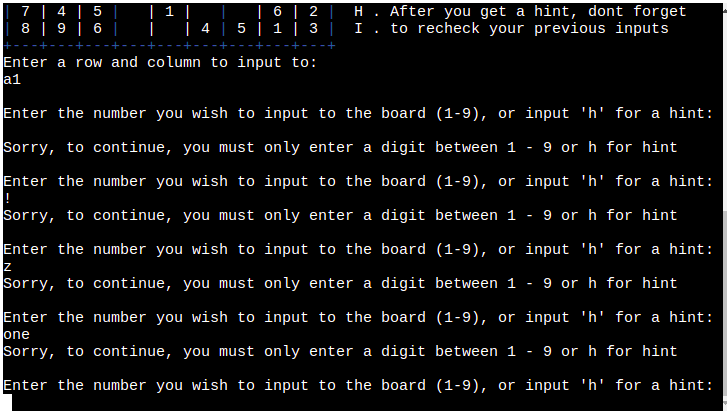

# Sudoku-P3 

## Table of Contents 
- <a href="#about">About Sudoku-P3</a>
- <a href="#how_to">How to play</a>
- <a href="#features">Features</a>
  - <a href="#difficulty">Difficulty Settings</a>
  - <a href="#board">Board</a>
  - <a href="#input">Colored Input</a>
  - <a href="#rules">Rules</a>
  - <a href="#val_check">Validity Check</a>
  - <a href="#timer">Timer</a>
  - <a href="#solution">Solution</a>
  - <a href="#play_again">Play Again</a>
  - <a href="#input_val">Input Validation</a>
  - <a href="#future">Future Features</a>
- <a href="#data_model">Data Model</a>
- <a href="#logic">Logic flow</a>
- <a href="#testing">Testing</a>
  - <a href="#bugs">Bugs</a>
    - <a href="#solved_bug">Solved</a>
    - <a href="#remaining_bug">Remaining</a>
  - <a href="#validator_test">Validator Testing</a>
- <a href="#deployment">Deployment</a>
- <a href="#credits">Credits</a>
  - <a href="#tutorials">Tutorials</a>
  - <a href="#aknowledgements">Aknowledgements</a>

<section id="about">

# About Sudoku-p3
Sudoku-P3 is a Python terminal game. It is deployed on heroku and uses a mock terminal made by Code institute. 

Users can play the classic game of Sudoku popularised by Maki Kaji.

Users can select an easy, medium or hard Sudoku puzzle to solve, get hints if they are stuck on a square, and after finishing the puzzle users can see correct solution as well as see how long it took to fill the board. 

[The deployed site is here!](https://sudoku-p3.herokuapp.com/)

</section>
<section id="how_to">

# How to play 

Sudoku-P3 is based on the classic pen and paper game Sudoku, popularised by Maki Kanji. You can learn more about Sudoku [here](https://en.wikipedia.org/wiki/Sudoku)

The rules for Sudoku are quite simple. 

- There is a 9 x 9 grid which must be filled with numbers
- The game starts with some squares already filled in
- only the numbers 1 - 9 can be used 
- Every square must contain one number 
- Each 3×3 box can only contain each number from 1 to 9 once
- Each vertical column can only contain each number from 1 to 9 once
- Each horizontal row can only contain each number from 1 to 9 once

</section>

<section id="features">

# Features 

## 
Difficulty Settings

- Users can select the level of difficulty, easy, medium or hard. 
- The program will make a request to an API called [suGOku](https://sugoku.herokuapp.com/) and return the numbers for the board in the form of a Python list. 
- More information about making requests to suGOku can be found [here](https://github.com/bertoort/sugoku).

## 
Board

- Blue borders for each 3x3 grid to make the different lines and grids stand out for the user. 
- Rows lettered A - I.
- Columns numbered 1 - 9.

## 
Colored Input</a>
- User input in red.
- Hint input in yellow 
- numbers generated by board are in white 

## 
Rules

- The rules for how to play are to the right of the board.

## 
Validity Checker

- If, by the rules of sudoku, a number conflicts with yellow or white number, it can not be inputed. 
- If a number wants to be placed in a cell containing a white or yellow number, it can not be placed. 
- Red numbers can be updated.

## 
Timer

- When user has finished filling the board a message displaying how long it took to finish the puzzle is displayed. 

## 
Solution

- When user has finished filling the board they can choose to see the solution to the board. 

## 
Play Again

- When user has finished filling the board they can choose play again or quit. 

## 
Input Validation

- Difficulty select
  - You can not select anything other than 1, 2 or 3

- Row, Column input 
  - You can only input a letter (a-i) followed by a number(1-9)

- Number Input 
  - You can only input number (1-9) or h for a hint 

- See solution & play again input
  - You can only enter 'y' or 'n'

## 
Future Features

- implement app into a GUI like pygame
- comparing time against previous attempts 
- exporting a generated board into a pdf for printing 

</section>