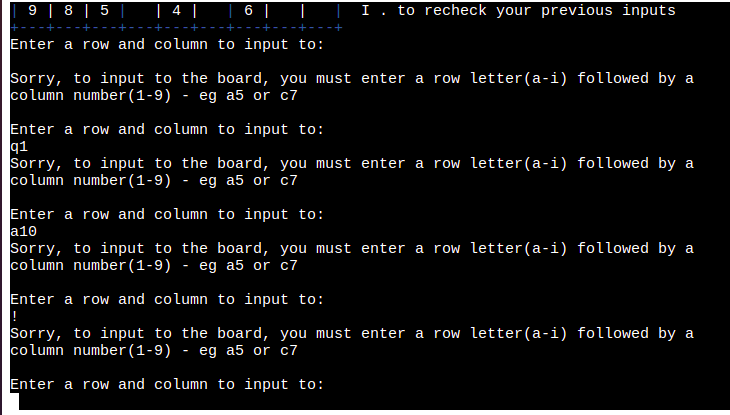
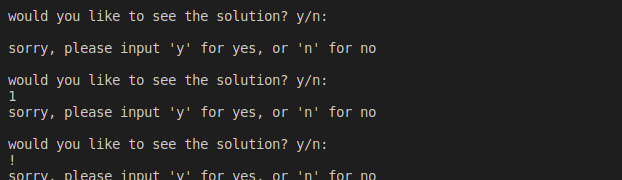

# Sudoku-P3 

## Table of Contents 
- <a href="#about">About Sudoku-P3</a>
- <a href="#how_to">How to play</a>
- <a href="#ux">UX Design</a>
- <a href="#features">Features</a>
  - <a href="#difficulty">Difficulty Settings</a>
  - <a href="#board">Board</a>
  - <a href="#input">Colored Input</a>
  - <a href="#rules">Rules</a>
  - <a href="#val_check">Validity Check</a>
  - <a href="#timer">Timer</a>
  - <a href="#solution">Solution</a>
  - <a href="#play_again">Play Again</a>
  - <a href="#input_val">Input Validation</a>
  - <a href="#future">Future Features</a>
- <a href="#data_model">Data Model</a>
  - <a href="#attributes">Attributes</a>
  - <a href="#methods">Methods</a>
- <a href="#logic">Logic flow</a>
- <a href="#testing">Testing</a>
  - <a href="#bugs">Bugs</a>
  - <a href="#validator_test">Validator Testing</a>
- <a href="#deployment">Deployment</a>
- <a href="#credits">Credits</a>
  - <a href="#tutorials">Tutorials</a>
  - <a href="#aknowledgements">Aknowledgements</a>

<section id="about">

# About Sudoku-p3
Sudoku-P3 is a Python terminal game. It is deployed on heroku and uses a mock terminal made by Code institute. 

The code makes use of four modules. 
  - time - to measure how long it takes the user to complete the puzzle.
  - termcolor - a module to output text in the terminal in ANSII color format. More information about termcolor can be found [here](https://pypi.org/project/termcolor/)
  - requests - to reach out to an API called sugoku and get back a 2d list of sudoku numbers to be used in the board. More information about sugoku can be found [here](https://github.com/bertoort/sugoku)
  - copy - to make copies of the grid variable that stores the 2d list of numbers that make up the generated sudoku game board. 

Users can play the classic game of Sudoku popularised by Maki Kaji.

Users can select an easy, medium or hard Sudoku puzzle to solve, get hints if they are stuck on a square, and after finishing the puzzle users can see correct solution as well as see how long it took to fill the board. 

[The deployed site is here!](https://sudoku-p3.herokuapp.com/)

</section>
<section id="how_to">

# How to play 

Sudoku-P3 is based on the classic pen and paper game Sudoku, popularised by Maki Kanji. You can learn more about Sudoku [here](https://en.wikipedia.org/wiki/Sudoku)

The rules for Sudoku are quite simple. 

- There is a 9 x 9 grid which must be filled with numbers
- The game starts with some squares already filled in
- only the numbers 1 - 9 can be used 
- Every square must contain one number 
- Each 3×3 box can only contain each number from 1 to 9 once
- Each vertical column can only contain each number from 1 to 9 once
- Each horizontal row can only contain each number from 1 to 9 once

</section>

<section id="ux">

</section>

<section id="features">

# Features 

## 
Difficulty Settings

- Users can select the level of difficulty, easy, medium or hard. 
- The program will make a request to an API called [suGOku](https://sugoku.herokuapp.com/) and return the numbers for the board in the form of a Python list. 
- More information about making requests to suGOku can be found [here](https://github.com/bertoort/sugoku).

## 
Board

- Blue borders for each 3x3 grid to make the different lines and grids stand out for the user. 
- Rows lettered A - I.
- Columns numbered 1 - 9.

## 
Colored Input</a>
- User input in red.
- Hint input in yellow 
- numbers generated by board are in white 

## 
Rules

- The rules for how to play are to the right of the board.

## 
Validity Checker

- If, by the rules of sudoku, a number conflicts with yellow or white number, it can not be inputed. 
- If a number wants to be placed in a cell containing a white or yellow number, it can not be placed. 
- Red numbers can be updated.

## 
Timer

- When user has finished filling the board a message displaying how long it took to finish the puzzle is displayed. 

## 
Solution

- When user has finished filling the board they can choose to see the solution to the board. 

## 
Play Again

- When user has finished filling the board they can choose play again or quit. 

## 
Input Validation

- Difficulty select
  - You can not select anything other than 1, 2 or 3

- Row, Column input 
  - You can only input a letter (a-i) followed by a number(1-9)

- Number Input 
  - You can only input number (1-9) or h for a hint 

- See solution & play again input
  - You can only enter 'y' or 'n'

## 
Future Features

- implement app into a GUI like pygame
- comparing time against previous attempts 
- exporting a generated board into a pdf for printing 

</section>

<section id="data_model">

# Data Model

The Sudoku board is made from a Board class. There is also an instance of a solved board made from the Board class for generating hints.

The Board class needs to be passed a grid as a parameter. 

## 
Attributes

The Board class has 6 attributes 

### self.grid

- The grid is a 2d list. There are 9 lists that each make a row of the sudoku board. When the difficulty of the game is selected the program makes a request to the Sugoku Api which returns the grid. 

### self.copy_grid

- The copy grid is used for crosschecking user input against the original grid. If a number is present in the copy grid, it means it is a number that can not be overwritten.

### self.border 

- The top and bottom border of the board printed in the terminal.

### self.section_bottom

- Every 3 rows there will be another blue border. This was the best way I could think to make the board visually stand out in the terminal. 

### self.side 

- This gives the row letters and how to play rules printed to the right of the board. 

### self.row_index 

- This keeps track of sections printed during one of the Board class methods.
 
## 
Methods

The Board class contains many methods including: 

### remove_zeros

- This goes through the grid and replaces any 0 with an empty string. This is nescessary to print blank spaces in the terminal. The 0's are a product of the grid supplied by the API. 

### print_section 

- This is called from another function. It essentially prints 3 rows by printing a number(i) and a post (|). 

### print_board 

- Starts by printing the column numbers and border followed by calling print_section method then self.section_bottom x 3  for each 3x3 section, then followed buy the last border at the bottom. 

### input_user_value 

- checks the cell user wishes to input to is empty and is a valid cell ie, does not conflict with another cell according to sudoku rules. If it is the number is printed in red to denote it as a number inputed by users own logic/guess. 

### generate_hint 

- It will cross reference the cell the user wishes to input to, cross reference with a copy of the solved grid to see what number is there, then it will input that number into the game board grid colored yellow to denote it as a number that comes from a hint. 

### check_solved 

- Goes through each cell and if it finds no empty cells it means the board has been solved. 

### next_empty_cell 

- Goes thought the grid row by row left to right and returns the next available empty cell. 

### solve 

- The solve function is the meat of the application in my opinion. It recursively checks each cell for possible numbers. When it finds a cell with no possible input it will backtrack to the last cell and try a different number and so on until the board is solved. I referenced three main tutorials to learn about recursion and backtracking. 

  -  https://www.youtube.com/watch?v=8lhxIOAfDss

      - A introduction to recursion from computerphile 
  
  - https://www.youtube.com/watch?v=G_UYXzGuqvM

    - recursion in sudoku tutorial from computerphile 

  - https://www.youtube.com/watch?v=tvP_FZ-D9Ng

    - Another sudoku solver using recursion from Kylie Ying

- there are 3 steps to the solve function 

  - step 1 is to find the next empty cell by calling the next_empty_cell funciton. 

  - step 2 is to try each number 1-9 in that cell by calling the possible method. 

  - step 3 is to input the number and continue to the next cell. If board can not be solved this way then it will go back to previous cell and try a different number. 

### possible 

- Helper funciton that will first check each row, then column then each 3x3 grid to see if a value from 1-9 will work. 

</section>

<section id="logic">

# Logic Flow 

When the program begins, the main game loop begins. The user must select a difficulty. Based on the difficulty, two instances of the Board class is generated, 1 unsolved and 1 solved. Then the game timer starts. 

The user must enter a valid cell and then select a number between 1-9 or "h" for a hint. 

Every time the user inputs to the board the program checks if the board is solved or not and prints a new updated board with the input in red for user input or yellow for a hint. 

Along the way each input is validated before moving onto the next step. 

At the end of the game the user can choose to play again or not. 

The following flow diagram illustrates the logic of the game and all of the user choices, input validation and loops. 

</section>

<section id="testing">

# Testing 

I have manually tested the application by: 
- passing through a pep8 linter to confirm there are no problems 
- a lot of input validation testing such as:
  - blank inputs(enter)
  - input strings where expecting numbers 
  - inputing special characters 
  - inputing numbers that conflict according to sudoku rules 
  - inputting letters other than a-i and numbers greater than 1-9 
- Testing if it works on my local terminal and the heroku mock terminal made by code institute. 

## 
Bugs

- Solved Bugs 
  - Originally, the solved board was printed in yellow. Unfortunately, the termcolor library caused a lot of errors when used with the solve function. It would always solve the board with lots of conflicting numbers. I fixed this bug by leaving the solved grid white and changing one number by itself to yellow, when called from the generate_hint function.
  - Again, I had an issue when trying to use termcolor to print a board with a mix of the final user board and any numbers that got wrong in a different color. The solution would never solve correctly and be full of conflicting numbers. To solve this, I just gave the user the option to see the solution at the end printed as a seperate board. It is not the optimal user experience solution, but it is an acceptable trade off to make the program work correctly. 

- Unsolved Bugs 
  - Very rarely, the Sugoku API can be slow to respond and a user can wait about 5-10 seconds for the API to return a grid. 

## 
Validator Testing

I passed the code through [PEP8 online validator](http://pep8online.com/) and it returned no errors or issues

</section>